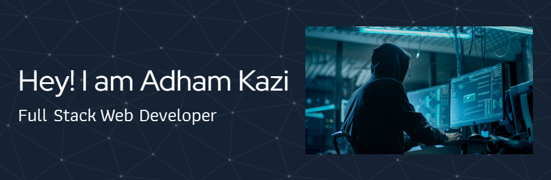

<h1 align="center">Hi 👋, I'm Adham Kazi</h1>
<h3 align="center">A Full Stack Developer who loves building projects.I am equipped with a variety of technologies and tools to help me build the best possible product</h3>

- 🌱 I’m currently learning **Frameworks and Database**

- 👨‍💻 All of my projects are available at [https://adhamkazi.github.io/](https://adhamkazi.github.io/)

- 📫 How to reach me **kaziadham95@gmail.com**

- 📄 Know about my experiences [https://drive.google.com/file/d/1BJHyYy6mkRy63G3Pg3eqiqA0PlHz6UKf/view](https://drive.google.com/file/d/1BJHyYy6mkRy63G3Pg3eqiqA0PlHz6UKf/view)

## 🌐 Socials:
 

# 💻 Tech Stack:
             
# 📊 GitHub Stats:
 
 

## 🏆 GitHub Trophies

### ✍️ Random Dev Quote

---

<!-- Proudly created with GPRM ( https://gprm.itsvg.in ) -->
